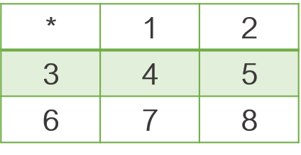
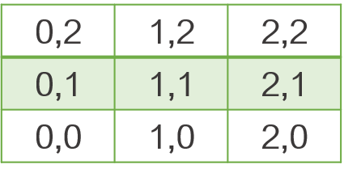
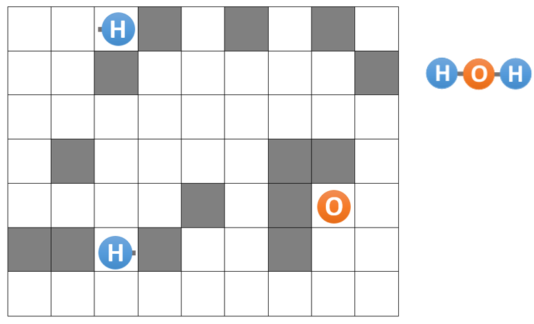
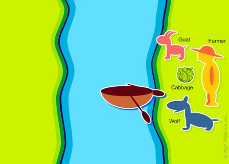

# Auditory exercise 4 - Informed search

## Example - Puzzle

A puzzle 3x3 is given, that has fields with numbers from 1 to 8 and an empty field. The empty field is marked with ‘\*’.

The problem question is how to go from an initial puzzle ordering to a goal puzzle ordering, as in:

Actions: the actions possible are moving the empty field:
- **Up**
- **Down**
- **Left**
- **Right**

When defining the actions, it's important to make sure they're possible in the given puzzle. 

We define the state as a string with 9 characters (8 numbers and ‘\*’).
The string is stores the fields starting from the first to the third row, left to right. 
Example: initial puzzle state is “\*32415678”, the goal state is “\*12345678”.

##### Heuristic

1. Number of fields in the wrong spot

2. Manhattan distance to the goal state

To define distance, we need to define a coordinate system
The beginning of the coordinate system is set in the lower left puzzle corner
We define a dictionary for every puzzle field coordinates 
We define a function that computes Manhattan distance for the puzzle. 
This function at input takes two integers, which are the two fields with the numbers that we need to compute distance for

## Problem 1 - Explorer

Implement in Python a state representation about the problem for which, one of the possible initial states is like in the figure below

The little man needs to be brought to his home. The man can move on any adjacent field, horizontally or vertically. 
The obstacles 1 and 2 are moving vertically. Each of the obstacles is moving one field in the adequate direction with each movement of the little man.

Obstacle 1 moves downwards initially and Obstacle 2 upwards. Figure 2 gives an example movement of the man and the obstacles. 

 

When the obstacle reaches the end of the board, it switches direction and continues to move. 
If an obstacle and the man are on the same field, the man will be destroyed.

For all test examples, the look and size of the board are the same as in the figures. All test cases have the same initial position and movement direction for the obstacles. Each test case has a different starting position of the man and different position of the house. 

The initial code reads the input arguments for each test case. 

The movements need to be defined as follows:
- **Right** - move the man one position right
- **Left** - move the man one position left
- **Up** - move the man one position up
- **Down** - move the man one position down

Your code should have one function call that will print the man movement sequence. The movement sequence is the sequence of moves that will allow the man to reach the position of the house. 

Use informed search. Use manhattan distance as a heuristic function.

## Problem 2 - Molecule

Implement in Python a state representation about the problem for which one of the possible initial states is depicted in the figure.

Three atoms are placed on a 7x9 board (note that the two H-atoms are different: the first one has a link to the right, and the second one has a link to the left). The grey fields of the board represent obstacles.

The player can begin the game by arbitrarily choosing one of the three atoms. In each step the player arbitrarily chooses exactly one of the three atoms and "pushes" that atom in one of the four directions: up, down, left or right. 

The movement of this "pushed" atom continues in the chosen direction until the atom hits in an obstacle or in one of the other atoms (the atom always stops in the field which is adjacent to a field containing an obstacle or another atom in the corresponding direction).

Atoms can’t leave the board and can’t rotate.

The goal of the game is to bring the three atoms in a position in which they form the "molecule" shown next to the board (on the right side). The game terminates in the moment when the three atoms will be placed in the required position, in arbitrary three adjacent fields of the board.

The problem must be solved using the smallest number of moves.

For all test examples, the look and size of the board are the same as in the figure. All test cases have the same positions of the obstacles. Each test case has different starting positions for all of the three atoms.
The initial code reads the input arguments for each test case.

The movements need to be named as follows:
- **RightX** - move the atom X to the right (X can be either H1, O or H2)
- **LeftX** - move the atom X to the left (X can be either H1, O or H2)
- **UpX** - move the atom X up (X can be either H1, O or H2)
- **DownX** - move the atom X down (X can be either H1, O or H2)

Your code should have one function call that prints the output on the standard screen - it should print the movement sequence of the atoms from their initial position to a goal position on the table. 

Use informed search. Implement a heuristic function that would be permissible for this problem.

## Problem 3 - Farmer
Implement in Python a state representation about the problem for which one of the possible initial states is depicted in the figure.

You need to transfer the cabbage, the goat, the wolf and the farmer from the east to the west side of the river.
Only the farmer can move the boat.
The boat can carry the farmer and at most one other item or animal. 

Constraints: If left alone (without the farmer):
- The goat eats the cabbage
- The wolf eats the goat

Вашиот код треба да има само еден повик на функција за приказ на стандарден излез (print) со кој ќе ја вратите секвенцата од позиции на актерите која одговара на секвенцата на движења со која сите актери ќе бидат пренесени на западната страна на реката. 

Your code should have one function call that prints the output on the standard screen - it should print the movement sequence of the atoms from their initial position to a goal position on the table. 
Use informed search. Implement a heuristic function that would be permissible for this problem.

